# System Architecture & Security Posture Document
## Aurum Agentic AI: Autonomous Stock Trading & Fraud Prevention Suite

---

## 1. High-Level System Architecture Diagram

```mermaid
graph TD
    subgraph Data_Ingestion ["Data Ingestion & Tooling Layer"]
        A1[DuckDuckGo Financial News API]
        A2[YFinance Historical OHLCV Engine]
        A3[Digital Banking Transaction Logs]
    end

    subgraph Agentic_Core ["4-Agent Sequential Core Architecture"]
        B1["Agent 1: News & Sentiment Agent<br/><i>(Scans Public Mood & Headlines)</i>"]
        B2["Agent 2: Market Predictor Agent<br/><i>(Computes 50/200-SMA, RSI, MACD)</i>"]
        B3["Agent 3: Profit & Loss Risk Agent<br/><i>(1% Capital Risk, SL/TP Guardrails)</i>"]
        B4["Agent 4: Execution & Response Agent<br/><i>(Alpaca Bracket Payload & XAI Alerts)</i>"]
    end

    subgraph Mathematical_Engine ["Consensus & XAI Mathematical Engine"]
        C1["Fraud Probability Score: FPS_i = σ(∑ w_j · f_ij)"]
        C2["Agent Consensus Risk Score: ACRS = (1/k) ∑ FPS_a"]
        C3["Collaboration Confidence Index: CCI = (∑ δ_a · r_a) / ∑ r_a"]
    end

    subgraph Presentation_Layer ["Presentation & Dispatch Layer"]
        D1["Interactive Gold Web UI<br/><i>(http://localhost:8000)</i>"]
        D2["Alpaca Brokerage Gateway<br/><i>(Paper Trading API)</i>"]
        D3["Real-Time XAI Threat Monitor<br/><i>(BLOCK / MFA / ALLOW Alerts)</i>"]
    end

    A1 --> B1
    A2 --> B2
    A3 --> C1
    B1 -- "Sentiment Score & Summary" --> B2
    B2 -- "Directional Stance (BULLISH)" --> B3
    B3 -- "Approved Trade & Risk Parameters" --> B4
    C1 --> C2 --> C3 --> B4
    B4 --> D1
    B4 --> D2
    C3 --> D3
```

---

## 2. Component Architecture Breakdown

### A. Data & Tooling Layer
- **Web & Sentiment Search**: Uses `duckduckgo-search` and `yfinance` news parsers to pull real-time headlines.
- **Technical Indicator Engine**: Downloads 1-year daily OHLCV stock history via `yfinance` and computes 50-day Simple Moving Average (SMA), 200-day SMA, Relative Strength Index (RSI 14), and Moving Average Convergence Divergence (MACD 12, 26, 9).
- **Banking Transaction Data Generator**: Generates realistic 10,000-sample imbalanced transaction datasets (99.0% legitimate, 1.0% fraud) incorporating amount z-scores, velocity, failed logins, device ID changes, proxy IPs, and location jump distances.

### B. 4-Agent Autonomous Pipeline Architecture
1. **`NewsSentimentAgent`**: Formulates structured Pydantic models (`SentimentOutput`) producing a sentiment score bounded in `[-1.0, +1.0]` and a 2-sentence summary.
2. **`MarketPredictorAgent`**: Evaluates technical trend alignments and news sentiment to output a `BULLISH`, `BEARISH`, or `NEUTRAL` directional stance.
3. **`ProfitLossRiskAgent`**: Enforces strict mathematical guardrails. Halts the pipeline if stance is not `BULLISH`. If `BULLISH`, calculates:
   - Max Capital Risk: $100.00 (1% of $10,000 portfolio)
   - Entry Price: Current Market Price ($P_{entry}$)
   - Hard Stop-Loss: $P_{entry} \times 0.98$ (2% below entry)
   - Take-Profit Target: $P_{entry} \times 1.06$ (6% above entry to guarantee a 1:3 Risk-to-Reward ratio)
   - Position Sizing: $\lfloor \frac{\$100.00}{P_{entry} - StopLoss} \rfloor$
4. **`ExecutionAgent`**: Generates Alpaca paper trading bracket order payloads, verifies API key credentials, simulates HTTP 200 response dispatch, and outputs post-trade summary diagrams.

---

## 3. Security & Operational Posture

| Security & Risk Vector | Posture Implementation | Defensive Governance |
| :--- | :--- | :--- |
| **Capital Protection** | **1% Risk Limit & Hard Stop-Loss** | Strict math guardrails prevent single-trade drawdown exceeding $100. |
| **Brokerage Safety** | **Paper Trading API Isolation** | API credentials sanitization; bracket orders enforce automatic exit limits. |
| **Data Privacy** | **Federated Learning Principles** | Privacy-preserving model aggregation; raw customer data is never shared. |
| **Explainable AI (XAI)** | **Multi-Agent Consensus ($ACRS$ & $CCI$)** | $ACRS$ & $CCI$ thresholds guarantee transparent, auditable decision rationale. |
| **Fail-Safe Mechanism** | **Pipeline Halt on Uncertainty** | Any `NEUTRAL` or `BEARISH` signal immediately aborts execution. |

---

## 4. Paper Mathematical Formulations

1. **Fraud Probability Score ($FPS_i$)**:
   $$FPS_i = \sigma \left( \sum_{j=1}^n w_j \cdot f_{ij} \right)$$

2. **Agent Consensus Risk Score ($ACRS$)**:
   $$ACRS = \frac{1}{k} \sum_{a=1}^k FPS_a$$

3. **Collaboration Confidence Index ($CCI$)**:
   $$CCI = \frac{\sum_{a=1}^k \delta_a \cdot r_a}{\sum_{a=1}^k r_a}$$
